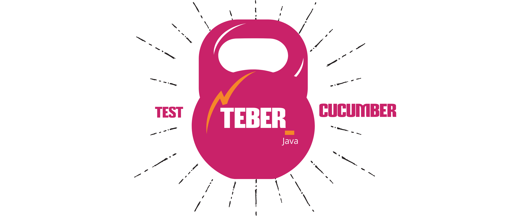

# Selenium Cucumber Framework in Page Object Model

Basic Framework setup for Selenium with cucumber, maven and allure in Java

[](LICENSE)
[](https://www.java.com/en/)
[]( https://stackoverflow.com/users/10505289/naresh-sekar )
[](CONTRIBUTING.md)
[](nareshnavinash@gmail.com)





## Supports
* Multiple browser automation
* Multi browser automation
* Allure reports
* Jenkins Integration
* Modes of run via CLI command
* Headless run
* Docker Execution
* Failed Screenshots

## Yet to be added
* Multi Thread run

## To run the tests
```
mvn clean install
```
This will install the dependencies and runs the test

### To run along with tags
```
mvn clean install -Dcucumber.options='--tags @sanity'
```

### To run along with tags and arguments
```
mvn clean install -Dcucumber.options='--tags @sanity' -DargLine="-DMODE=headless"
```

## To get allure report
```
mvn allure:serve
```
This will open the report in your default browser

## Multiple Browser
Currently supports for Chrome browser, but handled in such a way that framework can be easily configured to support multiple browsers. I used webdriver manager to resolve the driver-browser compatibility issues, use the same to add your designated browser (firefox, edge, ie, safari etc.,).

## Multi Browser
Initiate the driver class inside support package mutiple times with different WebDriver objects. You can execute the actions in multiple browsers at the same time by passing the WebDriver Object to the model methods.

## Reports
For better illustration on the testcases, allure reports has been integrated. Allure reports can also be integrated with jenkins to get a dashboard view. Apart from allure, cucumber's default reporting such as HTML, JSON, PRETTY, and additional logger file has been added to the `target/` folder.

## Jenkins Integration with Docker images
Get any of the linux with maven docker image as the slaves in jenkins and use the same for executing the UI automation with this framework (Sample docker image - `https://hub.docker.com/r/zenika/alpine-maven/`). From the jenkins bash directly call the `mvn clean install` command to execute the testcases.

In Jenkins pipeline, try to add the following snippet to execute the tests,
```
pipeline {
  agent any
  tools {
    maven 'M3'
  }
  stages {
    stage('Build') {
      steps {
        sh 'mvn clean install'
      }
    }
  }
}
```

## Headless Run
In `test-data/master.properties` file, if the mode is `headless`, the chrome will be initialized in headless mode which can be used to run in server. Screenshots will be added even if the browser runs in headless mode.

## CLI commands
In order to pass the cucumber tags, one can use mvn's command line option as 
```
mvn clean install -Dcucumber.options='--tags "@regression"'
or
mvn clean test -Dcucumber.options='--tags "@regression"'
```
Options to select the mode of run `headless or UI` from cli is added. By default have the mode in global.properties file as UI and while running the test suite in server use the following command to invoke the browser in headless mode
```
mvn clean install -DargLine="-DMODE=headless"
```

## Parallel run 
Parallel run is yet to be added!!!


## Built With

* [Cucumber](https://github.com/cucumber/cucumber-jvm) - Automation core framework
* [Maven](https://maven.apache.org/) - Dependency manager
* [Allure Cucumber](https://github.com/allure-framework/allure-cucumberjvm) - For Detailed reporting.
* [Selenium](https://www.seleniumhq.org/) - For web browser automation.

## Contributing

1. Clone the repo!
2. Create your feature branch: `git checkout -b my-new-feature`
3. Commit your changes: `git commit -am 'Add some feature'`
4. Push to the branch: `git push origin my-new-feature`
5. Create a pull request.

Please read [CONTRIBUTING.md](CONTRIBUTING.md) for details on code of conduct, and the process for submitting pull requests.

## Authors

* **[Naresh Sekar](https://github.com/nareshnavinash)**

## License

This project is licensed under the GNU GPL-3.0 License - see the [LICENSE](LICENSE) file for details

## Acknowledgments

* To all the open source contributors whose code has been referred to create this framework
